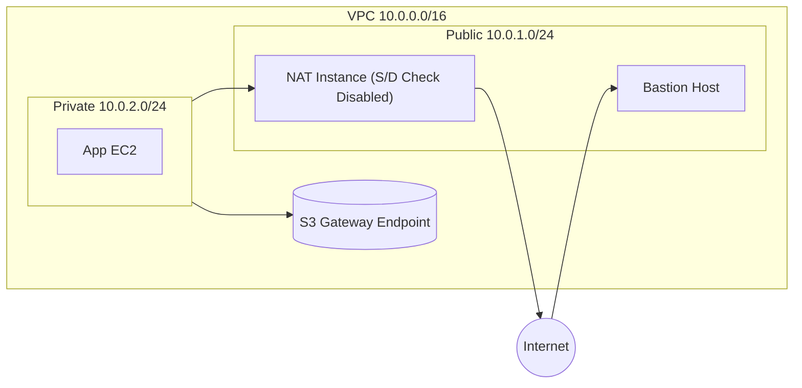

# Secure, Cost-Optimized AWS VPC Lab — Phase 1 Summary

## 🎯 Objective
Design and deploy a secure, low-cost AWS VPC environment suitable for learning and pre-production use.  
This phase demonstrates core AWS Solution Architect skills:
- Network isolation (Public vs Private)
- Secure administration via Bastion host
- Outbound access with a NAT Instance
- Private connectivity using S3 Gateway Endpoint
- Observability with VPC Flow Logs

---

## 🧩 Completed Steps

| Step | Title | Key Outcome |
|------|--------|-------------|
| [00](./00-setup.md) | Repository Setup | GitHub repo with README, ADR, runbooks, policies |
| [01](./01-architecture.md) | Network Architecture | CIDR, Subnets, Routes, and design decisions |
| [02](./02-network-setup.md) | VPC & Subnets | VPC, IGW, Route Tables established |
| [03](./03-bastion-host.md) | Bastion Host | Secure SSH access to private instances |
| [04](./04-nat-instance.md) | NAT Instance | Outbound internet via NAT (S/D check disabled) |
| [05](./05-s3-gateway-endpoint.md) | S3 Endpoint | Private S3 access without NAT costs |
| [06](./06-vpc-flow-logs.md) | Flow Logs | Network visibility via CloudWatch Logs |

---

## 🗺️ Architecture Overview

---

## 🧪 Validation Checklist

. Category	Check	Status

Network	VPC (10.0.0.0/16) with Public/Private subnets created	✅
Routing	Public RT → IGW, Private RT → NAT Instance	✅
Security	Bastion SG limited to fixed IP; Private SG only from Bastion	✅
NAT	Outbound works; S/D check disabled	✅
S3 Endpoint	Private EC2 can access S3 without NAT	✅
Observability	Flow Logs enabled to CloudWatch Logs	✅

---

## 🧱 Resource Overview

. Resource Type	Name / ID	Purpose

VPC	vpc-secure-lab	Main network container
Subnet	public-a / private-a	Public admin zone / Private workload zone
IGW	igw-secure-lab	Internet access for public subnet
NAT Instance	nat-secure-lab	Outbound for private subnet
Bastion Host	bastion-secure-lab	Admin entry point
Gateway Endpoint	com.amazonaws.<region>.s3	Private S3 connectivity
Flow Logs	secure-lab-flowlogs	Network observability

---

## 💡 Lessons Learned

NAT Instance requires S/D Check disabled and routing from private subnets (pages 5–6).

S3 Gateway Endpoint is free and ideal for private S3 access (pages 54–55).

Flow Logs provide visibility into ACCEPT/REJECT (page 64).

Cost-optimization is achievable without compromising security.

---

## 🚀 Next Phase Preview — DevOps Integration

In Phase 2, this architecture will evolve to include:

Terraform modules for reproducible IaC.

CI/CD pipelines via GitHub Actions or Jenkins.

Monitoring stack (Prometheus + Grafana) connected to VPC metrics.

Automated teardown & cost controls.
